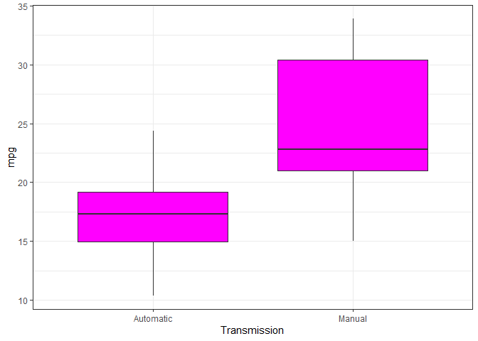
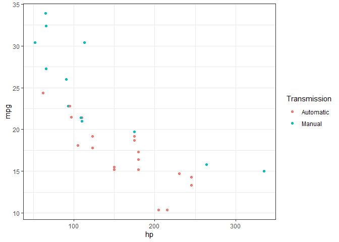
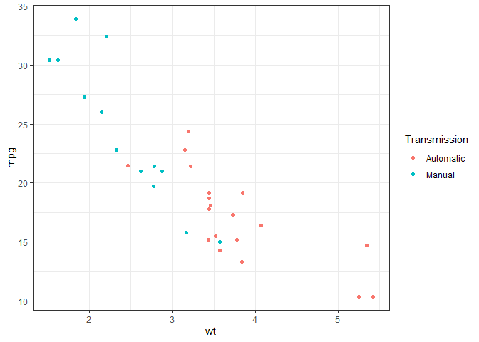

## Summary

### This report analyzes mtcars data set looking specifically at how having automatic vs manual transmission affect miles per galon for each car. I will use Stepwise Regression approach to select all the needed features to train the model, meaning that I will train various models with one regressor and move forward with the regressor with the smallest p-value. I will repeat the step until the final model is no longer giving me statistically significant results

First let us visualize how transmission affects the overall mpg. We can see that cars with manual transmission have much higher mpg


```r
library(ggplot2)

g <- ggplot(mtcars, aes(x=factor(am), y=mpg))+
   geom_boxplot(fill='magenta')+
   theme_bw()+
   labs(x='Transmission')+
   scale_x_discrete(labels=c('Automatic', 'Manual'))
print(g)
```

<!-- -->

Let's start by fitting a simple model with transmission only converting it to factor. The intercept term is assigned by the model to the cars with automatic transmission (0) and the coefficient of 7.245 is assigned to cars with manual transmission meaning that we would add 7.245 to total mpg for the cars with manual transmission. We get the R-squared score of 0.3385 which is very low so next step would be to find another regressor to train the model with


```r
fit_am <- lm(mpg ~ factor(am), mtcars)
summary(fit_am)
```

```
## 
## Call:
## lm(formula = mpg ~ factor(am), data = mtcars)
## 
## Residuals:
##     Min      1Q  Median      3Q     Max 
## -9.3923 -3.0923 -0.2974  3.2439  9.5077 
## 
## Coefficients:
##             Estimate Std. Error t value Pr(>|t|)    
## (Intercept)   17.147      1.125  15.247 1.13e-15 ***
## factor(am)1    7.245      1.764   4.106 0.000285 ***
## ---
## Signif. codes:  0 '***' 0.001 '**' 0.01 '*' 0.05 '.' 0.1 ' ' 1
## 
## Residual standard error: 4.902 on 30 degrees of freedom
## Multiple R-squared:  0.3598,	Adjusted R-squared:  0.3385 
## F-statistic: 16.86 on 1 and 30 DF,  p-value: 0.000285
```

Let us fit the models with the rest of the regressors individually and pick the one with the lowest p_value. 


```r
fit_am_cyl <- lm(mpg ~ factor(am)+cyl, mtcars)
fit_am_disp <- lm(mpg ~ factor(am) + disp, mtcars)
fit_am_hp <- lm(mpg ~ factor(am)+hp, mtcars)
fit_am_drat <- lm(mpg ~ factor(am)+drat, mtcars)
fit_am_wt <- lm(mpg ~ factor(am) + wt, mtcars)
fit_am_qsec <- lm(mpg ~ factor(am) + qsec, mtcars)
fit_am_vs <- lm(mpg~ factor(am) + factor(vs), mtcars)
fit_am_gear <- lm(mpg ~ factor(am) + gear, mtcars)
fit_am_carb <- lm(mpg ~ factor(am) + carb, mtcars)

feature_vec = c('cyl', 'disp', 'hp', 'drat', 'wt', 'qsec', 'vs', 'gear', 'carb')
one_fit = c(summary(fit_am_cyl)$coef[3,4],
      summary(fit_am_disp)$coef[3,4],
      summary(fit_am_hp)$coef[3,4],
      summary(fit_am_drat)$coef[3,4],
      summary(fit_am_wt)$coef[3,4],
      summary(fit_am_qsec)$coef[3,4], 
      summary(fit_am_vs)$coef[3,4],
      summary(fit_am_gear)$coef[3,4],
      summary(fit_am_carb)$coef[3,4])

print(feature_vec[which.min(one_fit)])
```

```
## [1] "hp"
```

```r
summary(fit_am_hp)
```

```
## 
## Call:
## lm(formula = mpg ~ factor(am) + hp, data = mtcars)
## 
## Residuals:
##     Min      1Q  Median      3Q     Max 
## -4.3843 -2.2642  0.1366  1.6968  5.8657 
## 
## Coefficients:
##              Estimate Std. Error t value Pr(>|t|)    
## (Intercept) 26.584914   1.425094  18.655  < 2e-16 ***
## factor(am)1  5.277085   1.079541   4.888 3.46e-05 ***
## hp          -0.058888   0.007857  -7.495 2.92e-08 ***
## ---
## Signif. codes:  0 '***' 0.001 '**' 0.01 '*' 0.05 '.' 0.1 ' ' 1
## 
## Residual standard error: 2.909 on 29 degrees of freedom
## Multiple R-squared:  0.782,	Adjusted R-squared:  0.767 
## F-statistic: 52.02 on 2 and 29 DF,  p-value: 2.55e-10
```

Looks like hp feature has the lowest p-value and the model with am/hp features performed much better with much higher R-squared score. Let us compare the two models by running the Analysis of Variance. Here we see that our two features model adds more significance to the results. 


```r
anova(fit_am, fit_am_hp)
```

```
## Analysis of Variance Table
## 
## Model 1: mpg ~ factor(am)
## Model 2: mpg ~ factor(am) + hp
##   Res.Df    RSS Df Sum of Sq      F   Pr(>F)    
## 1     30 720.90                                 
## 2     29 245.44  1    475.46 56.178 2.92e-08 ***
## ---
## Signif. codes:  0 '***' 0.001 '**' 0.01 '*' 0.05 '.' 0.1 ' ' 1
```

Let's visually explore the hp feature. There appears to be a strong negative correlation between hp and mpg.


```r
hp <- ggplot(mtcars, aes(x=hp, y=mpg)) + 
   geom_point(aes(color=factor(am)))+
   scale_color_discrete('Transmission', labels=c('Automatic', 'Manual'))+
   theme_bw()
print(hp)
```

<!-- -->

Let's move on by repeating the process to select the third feature to train our model. 


```r
fit_am_hp_cyl <- lm(mpg ~ factor(am)+hp+cyl, mtcars)
fit_am_hp_dist <- lm(mpg ~ factor(am) +hp+disp, mtcars)
fit_am_hp_drat <- lm(mpg ~ factor(am)+hp+drat, mtcars)
fit_am_hp_wt <- lm(mpg ~ factor(am)+hp+wt, mtcars)
fit_am_hp_qsec <- lm(mpg ~ factor(am)+hp+qsec, mtcars)
fit_am_hp_vs <- lm(mpg ~ factor(am)+hp+factor(vs), mtcars)
fit_am_hp_gear <- lm(mpg ~ factor(am)+ hp + gear, mtcars)
fit_am_hp_carb <- lm(mpg ~ factor(am)+hp+carb, mtcars)

hp_vec = c('cyl', 'dist', 'drat', 'wt', 'qsec', 'vs', 'gear', 'carb')
hp_fit = c(summary(fit_am_hp_cyl)$coef[4,4],
           summary(fit_am_hp_dist)$coef[4,4],
           summary(fit_am_hp_drat)$coef[4,4],
           summary(fit_am_hp_wt)$coef[4,4],
           summary(fit_am_hp_qsec)$coef[4,4], 
           summary(fit_am_hp_vs)$coef[4,4], 
           summary(fit_am_hp_gear)$coef[4,4], 
           summary(fit_am_hp_carb)$coef[4,4])
print(hp_vec[which.min(hp_fit)])
```

```
## [1] "wt"
```

```r
summary(fit_am_hp_wt)
```

```
## 
## Call:
## lm(formula = mpg ~ factor(am) + hp + wt, data = mtcars)
## 
## Residuals:
##     Min      1Q  Median      3Q     Max 
## -3.4221 -1.7924 -0.3788  1.2249  5.5317 
## 
## Coefficients:
##              Estimate Std. Error t value Pr(>|t|)    
## (Intercept) 34.002875   2.642659  12.867 2.82e-13 ***
## factor(am)1  2.083710   1.376420   1.514 0.141268    
## hp          -0.037479   0.009605  -3.902 0.000546 ***
## wt          -2.878575   0.904971  -3.181 0.003574 ** 
## ---
## Signif. codes:  0 '***' 0.001 '**' 0.01 '*' 0.05 '.' 0.1 ' ' 1
## 
## Residual standard error: 2.538 on 28 degrees of freedom
## Multiple R-squared:  0.8399,	Adjusted R-squared:  0.8227 
## F-statistic: 48.96 on 3 and 28 DF,  p-value: 2.908e-11
```

Our next feature is wt and the model has even better r squared score. Let us compare our three models.


```r
anova(fit_am, fit_am_hp, fit_am_hp_wt)
```

```
## Analysis of Variance Table
## 
## Model 1: mpg ~ factor(am)
## Model 2: mpg ~ factor(am) + hp
## Model 3: mpg ~ factor(am) + hp + wt
##   Res.Df    RSS Df Sum of Sq      F    Pr(>F)    
## 1     30 720.90                                  
## 2     29 245.44  1    475.46 73.841 2.445e-09 ***
## 3     28 180.29  1     65.15 10.118  0.003574 ** 
## ---
## Signif. codes:  0 '***' 0.001 '**' 0.01 '*' 0.05 '.' 0.1 ' ' 1
```

By comparing our three models we see that wt feature added even more significance to the outcomes. Let us explore it visually.  We see that wt has also strong negative correlation with mpg.


```r
wt <- ggplot(mtcars, aes(x=wt, y=mpg)) + 
   geom_point(aes(color=factor(am)))+
   scale_color_discrete('Transmission', labels=c('Automatic', 'Manual'))+
   theme_bw()
print(wt)
```

<!-- -->

Let's move on and see if we need to add another feature to the model


```r
fit_am_hp_wt_cyl <- lm(mpg ~ factor(am)+hp+wt+cyl, mtcars)
fit_am_hp_wt_disp <-lm(mpg ~ factor(am)+hp+wt+disp, mtcars)
fit_am_hp_wt_drat <-lm(mpg ~ factor(am)+hp+wt+drat, mtcars)
fit_am_hp_wt_qsec <-lm(mpg ~ factor(am)+hp+wt+qsec, mtcars)
fit_am_hp_wt_vs <-lm(mpg ~ factor(am)+hp+wt+factor(vs), mtcars)
fit_am_hp_wt_gear <-lm(mpg ~ factor(am)+hp+wt+gear, mtcars)
fit_am_hp_wt_carb <-lm(mpg ~ factor(am)+hp+wt+carb, mtcars)

wt_vec <- c('cyl', 'disp', 'drat', 'qsec', 'vs', 'gear', 'carb')
wt_fit <-c(summary(fit_am_hp_wt_cyl)$coef[5,4],
           summary(fit_am_hp_wt_disp)$coef[5,4],
           summary(fit_am_hp_wt_drat)$coef[5,4],
           summary(fit_am_hp_wt_qsec)$coef[5,4],
           summary(fit_am_hp_wt_vs)$coef[5,4],
           summary(fit_am_hp_wt_gear)$coef[5,4],
           summary(fit_am_hp_wt_carb)$coef[5,4])
print(wt_vec[which.min(wt_fit)])
```

```
## [1] "qsec"
```

```r
summary(fit_am_hp_wt_qsec)
```

```
## 
## Call:
## lm(formula = mpg ~ factor(am) + hp + wt + qsec, data = mtcars)
## 
## Residuals:
##     Min      1Q  Median      3Q     Max 
## -3.4975 -1.5902 -0.1122  1.1795  4.5404 
## 
## Coefficients:
##             Estimate Std. Error t value Pr(>|t|)   
## (Intercept) 17.44019    9.31887   1.871  0.07215 . 
## factor(am)1  2.92550    1.39715   2.094  0.04579 * 
## hp          -0.01765    0.01415  -1.247  0.22309   
## wt          -3.23810    0.88990  -3.639  0.00114 **
## qsec         0.81060    0.43887   1.847  0.07573 . 
## ---
## Signif. codes:  0 '***' 0.001 '**' 0.01 '*' 0.05 '.' 0.1 ' ' 1
## 
## Residual standard error: 2.435 on 27 degrees of freedom
## Multiple R-squared:  0.8579,	Adjusted R-squared:  0.8368 
## F-statistic: 40.74 on 4 and 27 DF,  p-value: 4.589e-11
```

This feature turns out to be qsec. Let's compare our four models
 

```r
anova(fit_am, fit_am_hp, fit_am_hp_wt, fit_am_hp_wt_qsec)
```

```
## Analysis of Variance Table
## 
## Model 1: mpg ~ factor(am)
## Model 2: mpg ~ factor(am) + hp
## Model 3: mpg ~ factor(am) + hp + wt
## Model 4: mpg ~ factor(am) + hp + wt + qsec
##   Res.Df    RSS Df Sum of Sq       F    Pr(>F)    
## 1     30 720.90                                   
## 2     29 245.44  1    475.46 80.2001 1.433e-09 ***
## 3     28 180.29  1     65.15 10.9892  0.002619 ** 
## 4     27 160.07  1     20.22  3.4115  0.075731 .  
## ---
## Signif. codes:  0 '***' 0.001 '**' 0.01 '*' 0.05 '.' 0.1 ' ' 1
```

We see that our four feature model no longer adds significance so we go back to our three feature model, let's look at the residuals plot. It shows that fitted values are not correlated to the residuals which is a good sign.


```r
plot(fit_am_hp_wt, which=1)
```

<!-- -->

To investigate further let us train the model on all the features, setting am and vs as factors.


```r
factor_cols <- c('vs', 'am')
mtcars[factor_cols] <- lapply(mtcars[factor_cols], factor)
fit_all <- lm(mpg ~ ., mtcars)
summary(fit_all)
```

```
## 
## Call:
## lm(formula = mpg ~ ., data = mtcars)
## 
## Residuals:
##     Min      1Q  Median      3Q     Max 
## -3.4506 -1.6044 -0.1196  1.2193  4.6271 
## 
## Coefficients:
##             Estimate Std. Error t value Pr(>|t|)  
## (Intercept) 12.30337   18.71788   0.657   0.5181  
## cyl         -0.11144    1.04502  -0.107   0.9161  
## disp         0.01334    0.01786   0.747   0.4635  
## hp          -0.02148    0.02177  -0.987   0.3350  
## drat         0.78711    1.63537   0.481   0.6353  
## wt          -3.71530    1.89441  -1.961   0.0633 .
## qsec         0.82104    0.73084   1.123   0.2739  
## vs1          0.31776    2.10451   0.151   0.8814  
## am1          2.52023    2.05665   1.225   0.2340  
## gear         0.65541    1.49326   0.439   0.6652  
## carb        -0.19942    0.82875  -0.241   0.8122  
## ---
## Signif. codes:  0 '***' 0.001 '**' 0.01 '*' 0.05 '.' 0.1 ' ' 1
## 
## Residual standard error: 2.65 on 21 degrees of freedom
## Multiple R-squared:  0.869,	Adjusted R-squared:  0.8066 
## F-statistic: 13.93 on 10 and 21 DF,  p-value: 3.793e-07
```

The all feature model still gets a good score but not of the features seem to be significant which can cause the model to overfit. Let's compare our three feature model to it. By running this analysis we see that using all features does not improve model performance.


```r
anova(fit_am_hp_wt, fit_all)
```

```
## Analysis of Variance Table
## 
## Model 1: mpg ~ factor(am) + hp + wt
## Model 2: mpg ~ cyl + disp + hp + drat + wt + qsec + vs + am + gear + carb
##   Res.Df    RSS Df Sum of Sq      F Pr(>F)
## 1     28 180.29                           
## 2     21 147.49  7    32.797 0.6671 0.6973
```

In conclusion we will stick with our three feature model of am/hp/wt however we see that transmission is no longer significant in predicting car's mpg. It depends a lot more on the horse power and weight. Our model still has R-squared score of 0.8227 and is less likely to overfit.


```r
summary(fit_am_hp_wt)
```

```
## 
## Call:
## lm(formula = mpg ~ factor(am) + hp + wt, data = mtcars)
## 
## Residuals:
##     Min      1Q  Median      3Q     Max 
## -3.4221 -1.7924 -0.3788  1.2249  5.5317 
## 
## Coefficients:
##              Estimate Std. Error t value Pr(>|t|)    
## (Intercept) 34.002875   2.642659  12.867 2.82e-13 ***
## factor(am)1  2.083710   1.376420   1.514 0.141268    
## hp          -0.037479   0.009605  -3.902 0.000546 ***
## wt          -2.878575   0.904971  -3.181 0.003574 ** 
## ---
## Signif. codes:  0 '***' 0.001 '**' 0.01 '*' 0.05 '.' 0.1 ' ' 1
## 
## Residual standard error: 2.538 on 28 degrees of freedom
## Multiple R-squared:  0.8399,	Adjusted R-squared:  0.8227 
## F-statistic: 48.96 on 3 and 28 DF,  p-value: 2.908e-11
```
